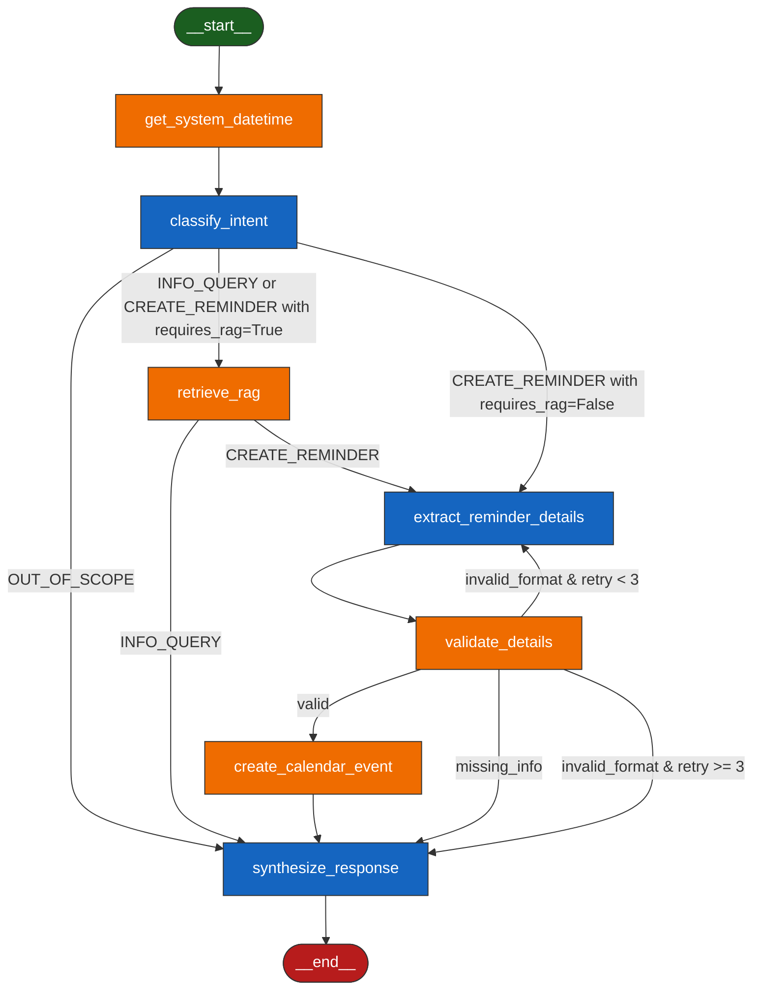

# Walkthrough - LangGraph Cyclic State Machine Agent

We have migrated the ChileAtiende assistant from the sequential **Plan-and-Execute** pattern to a robust, cyclic **State Machine** built with the **LangGraph** framework. 

Below is the detailed design, flow, and instructions for execution and verification.

---

## 1. State Machine Architecture & Flow

The state machine is driven by a global state (`AgentState`) storing intermediate computations, extracted details, validation statuses, and errors. It consists of **7 nodes** (3 LLM-based, 4 deterministic/system/tool nodes) and dynamic conditional edges.

### Mermaid Diagram


### Specialized Nodes
1. **`get_system_datetime` (Deterministic/System Tool Node)**: Fetches the server's current date and time (e.g. Lunes, 2026-06-20 17:35:21) and updates the state. This makes subsequent nodes deterministic and easy to test.
2. **`classify_intent` (LLM-based)**: Inspects query & history, combined with the server's time, to assign `INFO_QUERY`, `CREATE_REMINDER`, or `OUT_OF_SCOPE`. It also determines `requires_rag` (True/False) by checking if the required procedure details are already present in the history.
3. **`retrieve_rag` (Deterministic/Tool)**: Queries ChromaDB via `RAGService` to retrieve official procedure documentation (skipped if `requires_rag` is False).
4. **`extract_reminder_details` (LLM-based)**: Dynamically extracts procedure name, date/time (interpreting relative values against the system time stored in the state), email, and requirements. If `rag_context` is empty, it searches directly inside the conversation history to extract documents/requirements.
5. **`validate_details` (Deterministic)**: Verifies email matches regex, verifies date/time can be parsed, and checks for missing information. If format errors occur, it increments a retry counter and generates helpful guidance for the LLM.
6. **`create_calendar_event` (Deterministic/Tool)**: Calls `GoogleCalendarService` to schedule the booking.
7. **`synthesize_response` (LLM-based)**: Formulates the final, clean conversational response to the citizen (refusing out-of-scope queries, presenting RAG information, confirming calendar bookings, or requesting clarification).

---

## 2. Changes Made

### backend Dependencies
* Added `langgraph` in [requirements.txt](file:///c:/Users/lzamo/Desktop/LLM/Backend/requirements.txt) to enable state graph orchestration.

### New Service Implementation
* Created [langgraph_agent.py](file:///c:/Users/lzamo/Desktop/LLM/Backend/app/services/langgraph_agent.py):
  * Defined `AgentState` dictionary structure.
  * Implemented 6 Python nodes.
  * Configured dynamic conditional edges (`route_after_intent`, `route_after_rag`, `route_after_validation`).
  * Built a compiled graph.
  * Exposed `get_response(user_message, history)` as a drop-in replacement.
  * Created a test suite that streams node transitions over multiple typical test cases using `.stream()`.

### Plan-and-Execute Agent Optimization
* Updated [plan_execute_agent.py](file:///c:/Users/lzamo/Desktop/LLM/Backend/app/services/plan_execute_agent.py):
  * Modified `SYSTEM_PLANNER_PROMPT` to analyze conversation history and omit the `search_chileatiende_knowledge` step if requirements are already present.
  * Updated `SYSTEM_EXECUTOR_PROMPT` and execution loop to pass the general conversation history to the executor, enabling document extraction during recordatory steps when RAG is bypassed.

### FastAPI Backend Integration
* Updated [main.py](file:///c:/Users/lzamo/Desktop/LLM/Backend/app/main.py) to route incoming chat queries to the new LangGraph service:
```diff
-from app.services.plan_execute_agent import get_response
+from app.services.langgraph_agent import get_response
```

---

## 3. Verification

### Standalone Test Suite
You can execute the script standalone to see the streamed execution of the graph and output for different queries (out of scope, informational RAG, valid calendar booking, and missing-data booking):
```bash
cd Backend
.\venv\Scripts\python.exe app/services/langgraph_agent.py
```
This prints the status of each node as it executes, demonstrating routing choices and the final response.

### API Integration Test
Run the backend server:
```bash
cd Backend
.\venv\Scripts\uvicorn.exe app.main:app --reload
```
And test the endpoint using:
```bash
python tmp_test_chat.py
```
This ensures the agent integrates seamlessly with the backend API and the database store.
